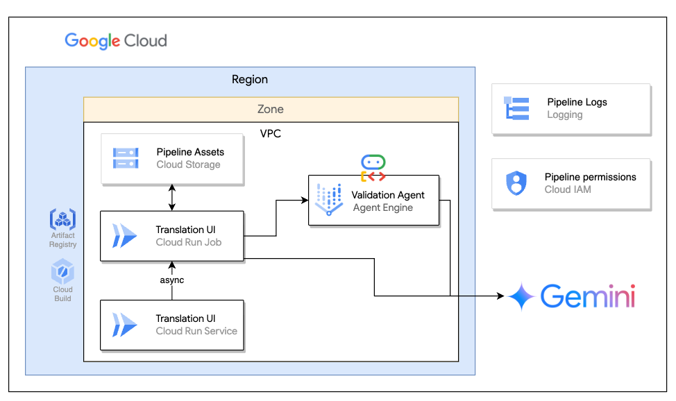

# AI-Powered Translation Solutions for Large Context Files

A translation pipeline leveraging Google Cloud infrastrucutre and Agent Development Kit (ADK) to handle large-scale content translation with context preservation and multi-agent validation.

🚨 IMPORTANT NOTICE

This project is a demonstration/proof-of-concept and is NOT production-ready.
Do not deploy this code to production environments without significant hardening and security review.

## Overview

The article, "How AI Can Localize Your Game Without Losing Its Soul," tackles the challenge of using LLMs for large-scale content translation, like a video game. The key issue is the "Output Chunking Problem": 
 LLMs' limited output forces translations to be split into many stateless API calls, leading to Terminological Drift, Style Inconsistency, and multiplying errors. 

The solution is a hybrid approach: deterministic tools handle initial translation and content splitting, while autonomous agents manage the critical validation phase to enforce consistency and stylistic nuance across all output chunks.

This GitHub repository demonstrates this pipeline, which supports various file types (including .epub and .txt), allows control over the speed/precision trade-off, and is designed to run asynchronously.

This solution translates large documents while maintaining:

- **Context preservation** through intelligent chunking
- **Terminology consistency** using entity dictionaries
- **Style adherence** with automated style guides
- **Quality validation** via multi-agent review

### Supported Formats
- Plain text files (.txt)
- Gettext translation files (.po)
- EPUB ebooks (.epub)

## Architecture


## Project Structure

### 1. [tvt_agent](./tvt_agent/README.md)
Multi-agent validation system for quality assurance (entity, style, editorial review).

### 2. [translation_service](./translation_service/README.md)
Core translation engine with document processing, chunking, and GCS management.

### 3. [sample_web_app](./sample_web_app/README.md)
Flask web interface for submitting translation jobs.


## Quick Start

### Prerequisites
```bash
# Enable required APIs
gcloud services enable aiplatform.googleapis.com
gcloud services enable storage-api.googleapis.com
gcloud services enable run.googleapis.com

#Ensure authentication
gcloud auth login

# Set environment

export GOOGLE_GENAI_USE_VERTEXAI=1
export GOOGLE_CLOUD_PROJECT=your_project_id
export GOOGLE_CLOUD_LOCATION=region # e.g. us-central1
export JOB_SERVICE_ACCOUNT="service_account_that_will_run_the_cloudrun_job"

```

### Installation
1. **Clone the repository**
    ```bash
    git clone <repository-url>
    cd translation-system
    ```

2. **Set up each component in this order** (follow detailed instructions in sub-project READMEs):
   - [Deploy Translation Validation Agent](./tvt_agent/README.md#deployment)
   - Update the translation_service/.env with the new AGENT_ENGINE_ID
   - [Deploy Translation Service](./translation_service/README.md#deployment)
    - Update the translation_service/.env with the new AGENT_ENGINE_ID
   - [Deploy Web Application](./sample_web_app/README.md#deployment)

### Basic Usage

1. **Access the web interface**
```
https://translation-app-service-<hash>-uc.a.run.app
```

2. **Submit a translation job**:
   - Upload source file (or provide GCS URI)
   - Select target language
   - Optionally provide entity glossary and style guide
   - Click "Translate"

3. **Monitor progress**:
   - View real-time status updates in Google CLoud Console (Cloud Logging) or using Log tabls under Agent Engine and CLoud Run solutions.
   - Access translated chunks in GCS
   - Download final assembled document from GCS

### Programmatic Usage
See main function in the trasnlation.py 


## 📊 GCS Folder Structure

Each translation session creates a structured folder in GCS:

```
translations/
└── {session-id}/
    ├── entity_extraction.txt              # Extracted glossary
    ├── style_instructions.txt             # Style guidelines
    ├── original_chunks/
    │   ├── original_chunk_0001.txt
    │   ├── original_chunk_0002.txt
    │   └── ...
    ├── prompts_for_translation/
    │   ├── translation_prompt_chunk_0001.txt #Basic prompt for translation with entities and style instructions
    │   └── ...
    ├── translated_chunks/
    │   ├── translated_chunk_0001.txt
    │   ├── final_translated_chunk_0001.txt  # After validation
    │   └── ...
    └── FINAL_document.txt                  # Reassembled output
```


## 🤝 Contributing

Contributions are welcome! Please follow these guidelines:

1. Fork the repository
2. Create a feature branch (`git checkout -b feature/AmazingFeature`)
3. Commit your changes (`git commit -m 'Add some AmazingFeature'`)
4. Push to the branch (`git push origin feature/AmazingFeature`)
5. Open a Pull Request
